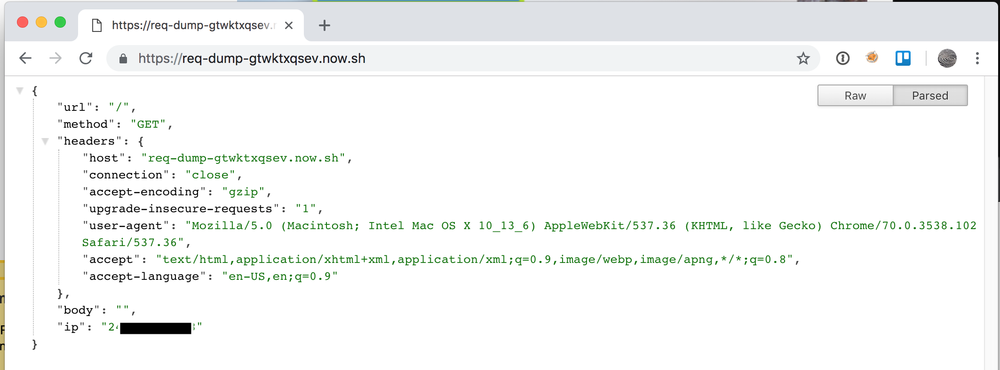
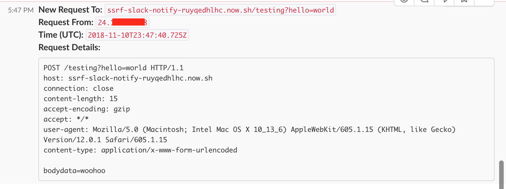
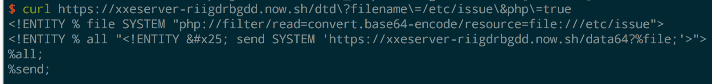
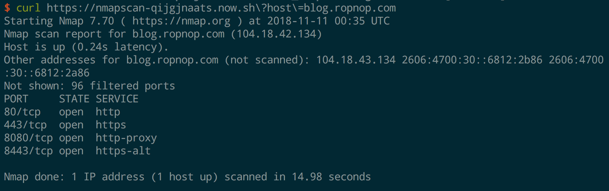
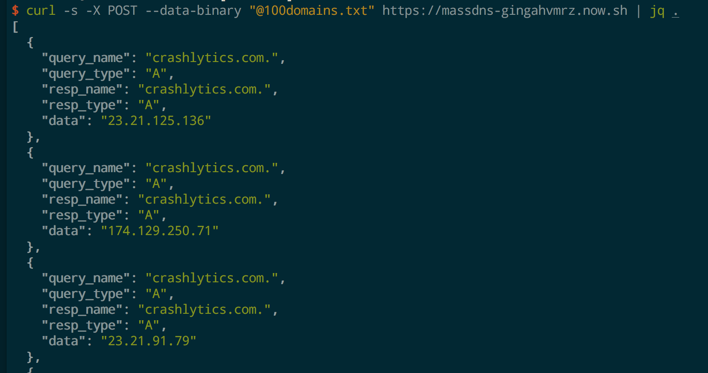

# Serverless Toolkit for Pentesters
This repository is a collection of serverless functions I have developed over the past few months doing bug bounties and penetration tests. I found myself constantly spinning up disposable VPSs to run tiny snippets of code or host some static resources and I got sick of wasting resources and managing that infrastructure to just run a simple command.

All of these examples were written to make use of Zeit's awesome [now.sh](https://zeit.co/now). While I've used other providers like AWS Lambda and Google Cloud Functions (including the really cool [serverless toolkit](https://serverless.com/)), I found that now.sh was the most straightforward and allowed custom Dockerfiles to be executed. Zeit recently rolled out [Now 2.0](https://zeit.co/blog/now-2) which actually breaks a lot of these, so the version is pinned to 1.0 for each of these deployments.

For more information and background, see the related blogpost: `TODO`

-ropnop

## List of Functions
Each function contains more information on how to install and use. The following functions are included:

### Static Example
This is useful for the times it's necessary to quickly host a CSRF payload, malicious JavaScript file, or something else on the internet, behind a fully trusted HTTPS certificate.

### Simple Redirect
This function takes a redirect URL as an environment variable and simply redirects any incoming request to it. Useful for some edge cases when testing for SSRF

### Gopher Redirect
Similar to above, this function redirects to the Gopher protocol. It reads raw data from a file and constructs a Gopher URL. This can be used to redirect a GET request to a POST request including data.

### Req Dump
This function simply dumps the incoming request to a JSON response. Useful for when you want to see what a request entails without having to capture it in Burp

### SSRF Slack
This function dumps incoming requests to a Slack webhook. Very useful for when testing SSRF or Blind XSS. It's possible to embed this URL in various places and be automatically notified if/when any server makes a request to it via Slack

### XXE Server
This function spins up a server to help with XXE OOB exfiltration. It's inspired by my other project, [xxetimes](https://github.com/ropnop/xxetimes). The server listens on `/dtd` and serves up a custom DTD file with nested entities to exfiltrate data over HTTP back to itself. It accepts a `filename` parameter to generate a specific file entity (otherwise it has be specified elswhere in the XML). When the server gets data back, it dumps it to Slack.

There are also options when targeting PHP to base64 encode/decode the data.

### Nmap Scanner
This example function shows how it's possible to run arbitrary binaries in Docker containers with serverless functions by capturing stdout with Express. This function simply runs an nmap scan with the `-F -Pn -sT` options against a target. It can be useful to quickly see if a port is open from an external or different IP address than where you are testing.

### MassDNS
Similar to the nmap example, this runs [massdns](https://github.com/blechschmidt/massdns) in a serverless Docker container. It accepts a newline separated list of domains in the POST body and runs massdns agaisnt them, returning results in JSON.

### Webshell
Someteimes you just want a shell. This uses gotty ontop of an Alpine base image with a few other extra pentester tools (nmap, ncat, etc). You can specify credentials in `username:password` format with the `GOTTY_CREDENTIALS` environment variable if you want.

# Next Steps
As I continue to play with serverless more I'll keep this updated. PR's and suggestions welcome!

With Zeit's move to Now 2.0, I fear that some of these may not be possible in the nearish future, so eventually I'll look at migrating to AWS or Google Cloud

Enjoy!
ropnop

