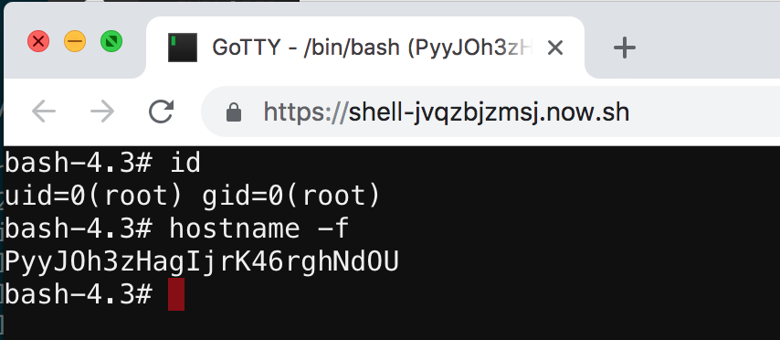

# Webshell
This is a fun PoC showing it's possible to get a fully interactive shell running in a serverless environment. It runs [gotty](https://github.com/yudai/gotty) on `/bin/bash` from within a customized Alpine linux image.

The included Dockerfile also installs a few useful pentester tools, such as `nmap`, `ncat`, `socat` and `openssh`.

Note: you'll find the environment pretty limited for any heavy-lifting, but if you need to quickly test something from the cloud and want to just drop into a bash shell without spinning up a VPS, this is very useful.

## Deployment
```
$ now --public
```

There is no authetnication by default. If you want to protect the terminal behind basic HTTP auth, it accepts a `GOTTY_CREDENTIALS` environment variable in the form `username:password`:

```
$ now secret add gotty-creds "admin:SuperSecretPassword"
$ now -e GOTTY_CREDENTIALS=@gotty-creds --public
```

## Usage
Browse to the URL in a modern browser and drop into a shell
